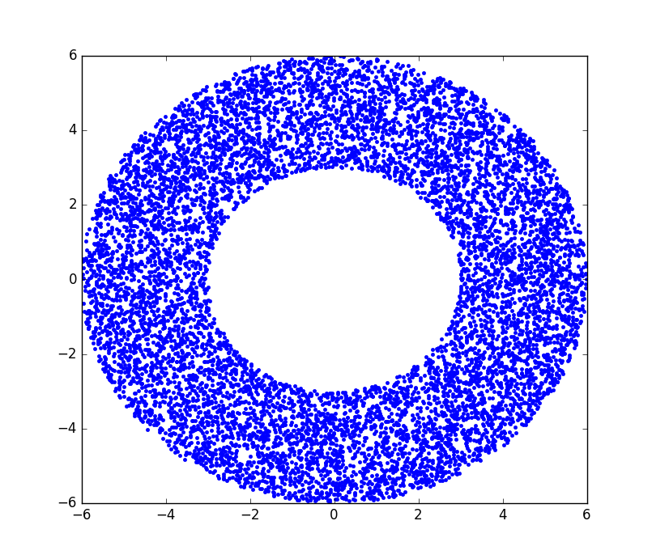

# A  Universal Random Number Generator

## Example:  Generating exponentially distributed data

    import numpy as np
    from univ_rand_gen import UnivRandGen
    from matplotlib import pyplot as plt

    cdf = lambda x: 1 - np.exp(-x)

    gen = UnivRandGen(func=cdf, type = 'cdf')

    data = [gen.random() for _ in range(100000)]

    plt.hist(data, bins = 100)

    plt.show()

## Example: Generating radii to generate points uniformly in an annulus

We desire the density p of the radius to be `p(r) = 2r/(rad_max**2 - rad_min**2)` so the cdf should be `F(r) = (r**2 - rad_min**2) / (rad_max**2 - rad_min**2)`

    import numpy as np
    from univ_rand_gen import UnivRandGen
    from matplotlib import pyplot as plt

    RAD_MIN = 3
    RAD_MAX = 6
    NUM_POINTS = 10000

    theta = 2*np.pi*np.random.random((NUM_POINTS,))

    radius_cdf = lambda rad: 0 if rad < RAD_MIN else 1 if rad > RAD_MAX else (rad**2 - RAD_MIN**2) / (RAD_MAX**2 - RAD_MIN**2)
    rad_gen = UnivRandGen(func = radius_cdf, type = 'cdf')
    radius = np.array([rad_gen.random() for _ in range(NUM_POINTS)])

    x = radius*np.cos(theta)
    y = radius*np.sin(theta)

    plt.plot(x,y,'.')

    plt.show()

